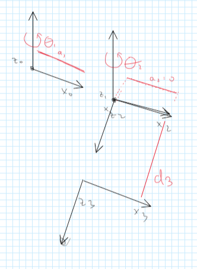
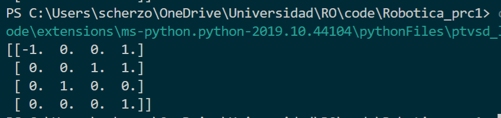
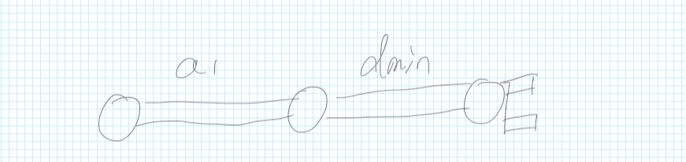
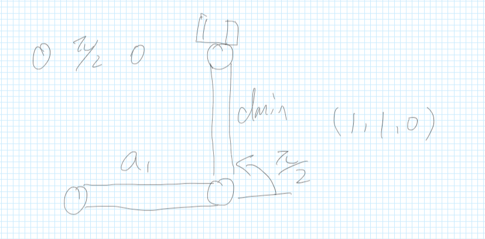
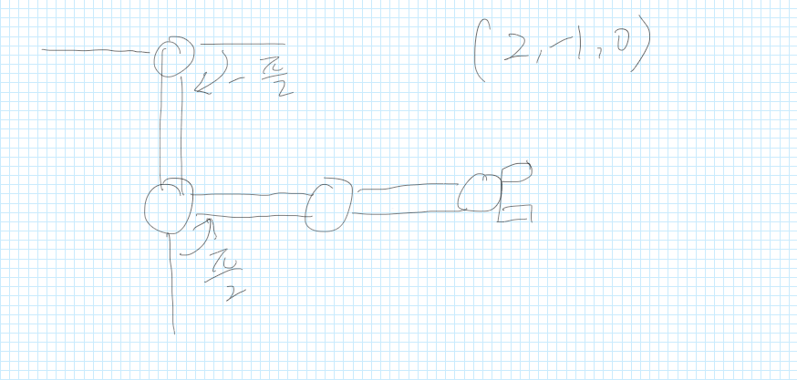
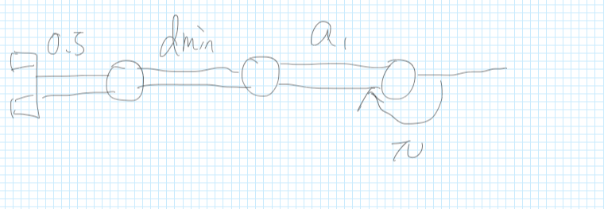
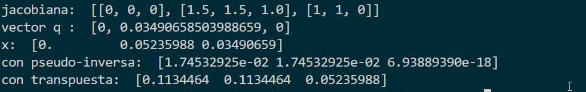
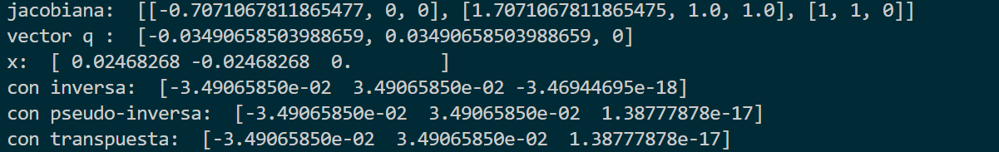
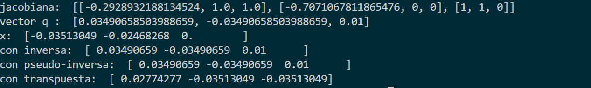
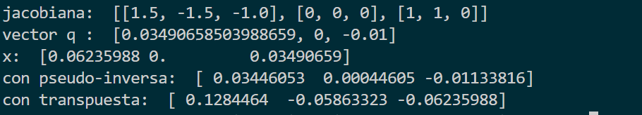

#  Robótica Práctica Manipuladores 

##  Christian Graf - Yutong Jin

###### **Descripción del manipulador**

El brazo robótico que se va a estudiar en todos los apartados de la práctica consta de tres ejes. Los dos primeros ejes de rotación son paralelos y decriben los movimientos del hombro y el codo, respectivamente. El tercer eje es prismático y realiza una extensión del antebrazo, de foma que el movimiento acerca o aleja la mano de la muñeca.

## M1. Configuración Geométrica

La primera parte es completamente teórica y consta de la definición de referenciales que permiten describir todos los movimientos que realiza el brazo y de la tabla de parámetros de Denavit-Hartenberg asociada con tales referenciales. En el caso de requerir algún valor que determine características del propio manipulador como las longitudes de los segmentos o valores mínimos y máximos de los parámetros, debe dejarse indicada mediante una constante.  

**Respuesta**:

Debido a que es imposible establecer la distancia en el eje $y$, debemos establecerla en el eje $z$ con $d_3 $, de esta manera, existiran siempre dos sumandos para que pueda funcionar este modelo: 

* Siempre se sumará $\theta_2+\pi/2$, para que el brazo del manipulador apunte hacia el frente.

* Siempre habrá un $d_{min}$ que representa la distancia minima de $d_3$



| **$\theta_i$** | $d_i$         | $\alpha_i$ | $a_i$ |
| -------------- | ------------- | ---------- | ----- |
| $\theta_1$     | 0             | 0          | $a_1$ |
| $\theta_2+ \pi/2 $ | 0             | $\pi/2$ | 0 |
| 0              | $d_{min}+d_3$ | 0 | 0 |


## M2. Cinemática Directa

**1.** Ecuaciones de la cinemática directa en forma matricial del manipulador y el estudio de los casos:

**Respuestas**:

**nota:** se asume $a_1=1$ y $d_{min}=1$ donde $a_1 $ es la longitud del segmento asociado al antebrazo. 

Sabemos que,

$A^i_{i-1}=\begin{pmatrix}
c_i & -cos(\alpha_i)s_i & sin(\alpha_i)s_i & a_ic_i\\
s_i & cos(\alpha_i)c_i & -sin(\alpha_i)c_i & a_is_i\\
0 & sin(\alpha_i) & cos(\alpha_i) & d_i \\
0 & 0 & 0 & 1
\end{pmatrix}$ 

Por lo que con nuestra tabla sacada en el apartado **M1** tenemos:

$A^1_{0}=\begin{pmatrix}
c_1 & -s_1 & 0 & a_1c_1\\
s_1 & c_1 & 0 & a_1s_1\\
0 & 0 & 1 & 0 \\
0 & 0 & 0 & 1
\end{pmatrix}$    $A^2_{1}=\begin{pmatrix}
c_2 & -s_2 & 0 & 0\\
s_2 & c_2 & 0 & 0\\
0 & 1 & 0 & 0 \\
0 & 0 & 0 & 1
\end{pmatrix}$    $A^3_{2}=\begin{pmatrix}
1 & 0 & 0 & 0\\
0 & 1 & 0 & 0\\
0 & 0 & 1 & d_3 \\
0 & 0 & 0 & 1
\end{pmatrix}$


donde $A_0^3=A_0^1 \cdot A_1^2 \cdot A_2^3 = \begin{pmatrix}
c_{12} & 0 & s_{12} & d_3s_{12}+a_1c_1\\
s_{12} & 0 & c_{12} & -d_3c_{12} + a_1s_1\\
0 & 1 & 0 & 0 \\
0 & 0 & 0 & 1
\end{pmatrix}$

**casos de estudio**:

-----

* $\vec{q} = (0,0,0)$

| **$\theta_i$** | $d_i$         | $\alpha_i$ | $a_i$ |
| -------------- | ------------- | ---------- | ----- |
| $0$    | 0             | 0          | $a_1$ |
| $\pi/2$ | 0             | $\pi/2$ | 0 |
| 0              | $d_{min}+0$ | 0 | 0 |

obtenemos:

$A_0^3=\begin{pmatrix}
0 & 0 & 1 & 2\\
1 & 0 & 0 & 0\\
0 & 1 & 0 & 0 \\
0 & 0 & 0 & 1
\end{pmatrix} \Rightarrow (x,y,z) = (2,0,0)$

-----

* $\vec{q} = (0,\pi/2,0)$

| **$\theta_i$** | $d_i$         | $\alpha_i$ | $a_i$ |
| -------------- | ------------- | ---------- | ----- |
| $0$    | 0             | 0          | $a_1$ |
| $ \pi/2 + \pi/2 $ | 0             | $\pi/2$ | 0 |
| 0              | $d_{min}+0$ | 0 | 0 |

obtenemos:

$A_0^3=\begin{pmatrix}
-1 & 0 & 1 & 1\\
0 & 0 & 0 & 1 \\
0 & 1 & 0 & 0 \\
0 & 0 & 0 & 1
\end{pmatrix} \Rightarrow (x,y,z) = (1,1,0) $

-----

* $\vec{q} = (-\pi/2,\pi/2,a)$

| **$\theta_i$** | $d_i$         | $\alpha_i$ | $a_i$ |
| -------------- | ------------- | ---------- | ----- |
| $-\pi/2$ | 0             | 0          | $a_1$ |
| $ \pi/2 + \pi/2 $ | 0             | $\pi/2$ | 0 |
| 0              | $d_{min}+a$ | 0 | 0 |

obtenemos:

$A_0^3=\begin{pmatrix}
0 & 0 & 1 & 2\\
1 & 0 & 0 & -1\\
0 & 1 & 0 & 0 \\
0 & 0 & 0 & 1
\end{pmatrix} \Rightarrow (x,y,z) = (2,-1,0) $

-----

* $\vec{q} = (\pi,0,a/2)$ 

| **$\theta_i$** | $d_i$         | $\alpha_i$ | $a_i$ |
| -------------- | ------------- | ---------- | ----- |
| $ \pi$ | 0             | 0          | $a_1$ |
| $\pi/2 $ | 0             | $\pi/2$ | 0 |
| 0              | $d_{min}+a/2$ | 0 | 0 |

obtenemos:

$A_0^3=\begin{pmatrix}
0 & 0 & -1 & -2.5 \\
-1 & 0 & 0 & 0\\
0 & 1 & 0 & 0 \\
0 & 0 & 0 & 1
\end{pmatrix}  \Rightarrow (x,y,z) = (-2.5,0,0)$

-----

**2. **Función que implementa la cinemática directa del manipulador $A^3_0$que recibe tres argumentos (los valores del parámetro de cada articulación) y devuelve la matriz que determina la posición y la orientación de la mano. Se pueden implementar todas las funciones que se consideren oportunas (por ejemplo, si se quiere hacer general, de rotaciones simples sobre los ejes, de matrices de cambio entre dos referenciales consecutivos $A^i_{i-1}$, etc.).

**respuesta**:

Hemos optado por una solucion *general*. Tenemos para este problema 2 funciones principales: 

**reference_transformation_matrix** es equivalente a $A_{i-1}^i$ 

```python
def reference_transformation_matrix(theta, d, alpha, a):
    res = [[m.cos(theta), -m.cos(alpha)*m.sin(theta), m.sin(alpha)*m.sin(theta), a*m.cos(theta)],
           [m.sin(theta), m.cos(alpha)*m.cos(theta), -m.sin(alpha)*m.cos(theta), a*m.sin(theta)],
           [0, m.sin(alpha), m.cos(alpha), d],
           [0, 0, 0, 1]]
    res = normalize_zeroes(res)
    return res
```

usamos luego normalize_zeroes para redondear a 0 los resultados que se acercan mucho a este. (problema de python que hemos solucionado, puesto que a veces algo que debe ser cero, da como resultado algo como 0.00001)

```python
def normalize_zeroes(m):
    res = m
    for i in range(len(res)):
        for j in range(len(res[0])):
            if m[i][j] < 0.001 and m[i][j] > -0.001:
                res[i][j] = 0
            else:
                res[i][j] = m[i][j]
    return res
```

finalmente **multiply_matrix** toma como argumento un array de matrices y las multiplica todas. Por lo que lo que estamos haciendo es realmente calcular **individualmente** todas las $A^i_{i-1}$ y luego obteniendo el resultado final poniendolo todo en un array y multiplicando. 

```python
def multiply_matrix(matrix_array):
    res = matrix_array[0]
    for m in range(1, len(matrix_array)):
        res = np.dot(res, matrix_array[m])
    return res
```

Con todo esto, tenemos el main en el que como ejemplo vamos a probar $\vec{q} = (0,\pi/2,0)$ del apartado anterior: 

```python
import math as m
from prc3 import *

m1 = reference_transformation_matrix(0, 0, 0, 1) # a1 = 1
m2 = reference_transformation_matrix(m.pi, 0, m.pi/2, 0)
m3 = reference_transformation_matrix(0, 1, 0, 0) # dmin = 2 
mArr = []
mArr.append(m1)
mArr.append(m2)
mArr.append(m3)
res = multiply_matrix(mArr)
print(res)

```

con output: 




## M3. Cinemática Inversa

**1.** Ecuaciones de la cinemática inversa del manipulador y el estudio de los casos a los que se llega como resultado en el apartado anterior. Obtener todas las soluciones y comparar con los $ \vec{q} $ propuestos en dicho apartado.

**respuesta**:

$d_{total} = \frac{-(2y_ec_{12}-2x_es_{12}) \pm \sqrt{(2y_ec_{12}-2x_es_{12})^2-4*a_1*(x_e^2+y_e^2-a_1^2)}}{2a_1}$

$d_{total}=d_3+d_{min}$

$c_2=\frac{x_e^2+y_e^2-a_1^2-d_{total}^2}{2a_1(d_{total})}$

$s_2 = \pm \sqrt{1-c_2^2}$

$\theta_2 = Atan 2 (s_2,c_2)$

$\theta_1 = \phi - \theta_2$

**casos de estudio**:

-----

* $(x,y,z) = (2,0,0)$  $\phi = \pi/2$

obetenemos 4 resultados: 

$(\pi,\pi,2) , (-\pi,\pi,2), (0,0,0), (0,0,0)$

Comparando con **M2**, podemos ver que los correctos son:  $(0,0,0), (0,0,0)$

-----

* $ (x,y,z) = (1,1,0)$  $ \phi=\pi$

obetenemos 4 resultados: 

$(\pi/2,\pi,0) , (-\pi/2,\pi,0), (\pi/2,\pi,0), (-\pi/2,\pi,0)$

Comparando con **M2**, ninguno concuerda... comentaremos esto en **M5**

-----

* $ (x,y,z) = (2,-1,0) $   $\phi=\pi/2$

obetenemos 4 resultados: 

$(\pi/2,\pi,1) , (-\pi/2,\pi/2,1), (\pi/2,\pi/2,1), (-\pi/2,\pi/2,1)$

Comparando con **M2**, podemos ver que los correctos son:  $ (-\pi/2,\pi/2,1),  (-\pi/2,\pi/2,1)$

-----

* $(x,y,z) = (-2.5,0,0)$   $\phi=3*\pi/2$

obetenemos 4 resultados: 

$(\pi,2 \pi,2.5) , (-\pi,2 \pi, 2.5), (0,\pi,0.5), (0,\pi,0.5)$

Comparando con **M2**, ninguno concuerda... comentaremos esto en **M5**

-----

**2.** Función que implementa la cinemática inversa del manipulador que recibe tres argumentos (posición de la mano en el plano y su orientación) y devuelve una lista con todos los posibles valores de parámetros de cada articulación que llevan al manipulador a esas posiciones. Debería probarse al menos con los casos de estudio del apartado anterior.

**respuesta**:

Para nuestra solución, hemos hecho una función que resuelve $d_{total}$, debido a que es una respuesta cuadrática, tendremos dos posibles soluciones. Luego, estas se pasan a una seguna función que resuelve el resto de los parámetros. Debido a que $c_2$ también es cuadrática, tendremos dos resultados. Debido a esto, siempre tendremos 4 resultados, de los cuales algunos probablemente no serán válidos.

```python
def kinematics_inverse(x, y, phi):
    a = 1
    b = 2 * (y * m.cos(phi) - x * m.sin(phi))
    c = m.pow(x, 2) + m.pow(y, 2) - m.pow(a1, 2)
    d1 = (-b + m.sqrt( m.pow(b, 2) - (4 * a * c) ) )/2*a
    d2 = (-b - m.sqrt( m.pow(b, 2) - (4 * a * c) ) )/2*a
    resultSet = []
    resultSet.append(calculate_result(x, y, phi, d1))
    resultSet.append(calculate_result(x, y, phi, d2))
    return resultSet

def calculate_result(x, y, phi, d):
    c2 = (m.pow(x, 2) + m.pow(y, 2) - m.pow(a1, 2) - m.pow(d, 2)) / (2 * a1 * d)
    s2Set = []
    s2Set.append(m.sqrt(1 - m.pow(c2, 2)))
    s2Set.append( - (m.sqrt(1 - m.pow(c2, 2))))
    resultSet = []
    resultSet.append( [m.atan2(s2Set[0], c2), phi - m.atan2(s2Set[1], c2) - m.pi/2, d - dMin] )
    resultSet.append( [m.atan2(s2Set[1], c2), phi - m.atan2(s2Set[1], c2) - m.pi/2, d - dMin] )
    return resultSet
```

## M4. Jacobiana 

**1.** Matriz jacobiana del manipulador y el estudio de los casos:

**respuestas**:

tenemos por cinemática directa nuestra matriz:

$A_0^3=A_0^1 \cdot A_1^2 \cdot A_2^3 = \begin{pmatrix}
c_{12} & 0 & s_{12} & d_3s_{12}+a_1c_1\\
s_{12} & 0 & c_{12} & -d_3c_{12} + a_1s_1\\
0 & 1 & 0 & 0 \\
0 & 0 & 0 & 1
\end{pmatrix}$

Por lo que podemos deducir:

$x_e =  d_3s_{12}+a_1c_1$

$y_e = -d_3c_{12} + a_1s_1$ 

$z_e = 0$ 

Definimos a la Jacobiana como:

$\dot x = J \dot q$ 

donde:

$J=$ $\begin{pmatrix}
\frac{\partial x}{\partial \theta_1} & \frac{\partial x}{\partial \theta_2} & \frac{\partial x}{\partial d}\\
\frac{\partial y}{\partial  \theta_1} & \frac{\partial y}{\partial  \theta_2} & \frac{\partial y}{\partial  d}\\
\frac{\partial z}{\partial  \theta_1}& \frac{\partial z}{\partial  \theta_2} & \frac{\partial z}{\partial d}\\
\frac{\partial \phi_x}{\partial  \theta_1} & \frac{\partial \phi_x}{\partial  \theta_2}& \frac{\partial \phi_x}{\partial  d}\\
\frac{\partial \phi_y}{\partial  \theta_1} & \frac{\partial \phi_y}{\partial  \theta_2} &\frac{\partial \phi_y}{\partial  d}\\
\frac{\partial \phi z}{\partial  \theta_1} & \frac{\partial \phi z}{\partial  \theta_2} & \frac{\partial \phi z}{\partial d}
\end{pmatrix}$  $\Rightarrow  J =\begin{pmatrix}
-a_1s_1 + d_3c_{12} & d_3c_{12}  & c_{12}\\
a_1s_1 + d_3s_{12} & d_3s_{12} & s_{12}\\
0 & 0 & 0  \\
0 & 0 & 0 \\
0&0&0\\
1&1&0
\end{pmatrix}$

Por lo que finalmente (eliminando filas de ceros) nos quedamos con:

$J =\begin{pmatrix}
-a_1s_1 + d_3c_{12} & d_3c_{12}  & c_{12}\\
a_1s_1 + d_3s_{12} & d_3s_{12} & s_{12}\\
1&1&0
\end{pmatrix}$

asi, para cualquier vector de movimiento $\dot q$, podemos obtener la posición final $\dot x = J \dot q $

**Nota importante:** de la manera que tenemos definida nuestra matriz, es necesario recordar que a cualquier vector inicial $\vec q $ es necesario transformarlo con los parametros minimos iniciales, es decir:  

$\vec q = (\theta_1,\theta_2,d) \Rightarrow \vec q = (\theta_1,\theta_2+\pi/2,d_{min}+d)$  

además, asumiremos $d_{min} = 1$ y $a_1 = 1$

**casos de estudio**:

-----
* $\vec{q} = (0,0,a/2), \vec{q} = (0,π/90,0)$

transformando tenemos:

$\vec{q} = (0,\pi/2,1.5), \vec{q} = (0,π/90,0)$

$\dot x = J \dot q = \begin{pmatrix}
0 & 0  &0\\
1.5  & 1.5 & 1\\
1&1&0
\end{pmatrix}  \cdot \begin{pmatrix}
0\\
\pi/90\\
0
\end{pmatrix}  = \begin{pmatrix}
0\\
0.05235988\\
0.03490659
\end{pmatrix}$

------

* $\vec{q}= (pi/4,−π/4,0), \vec q = (−π/90,π/90,0)$

transformando tenemos:

$\vec{q} = (\pi/4,\pi/4,1), \vec{q} = (-\pi/90,π/90,0)$

$\dot x = J \dot q = \begin{pmatrix}
-\frac{\sqrt{2}}{2} & 0  &0\\
\frac{\sqrt{2}}{2} + 1  & 1 & 1\\
1&1&0
\end{pmatrix}  \cdot \begin{pmatrix}
-\pi/90\\
\pi/90\\
0
\end{pmatrix}  = \begin{pmatrix}
0.02468268\\
-0.02468268 \\
0
\end{pmatrix}$

------
* $\vec q = (−\pi/4,π/4,0) ,\vec q = (π/90,−π/90,a/100) $

transformando tenemos:

$\vec{q} = (-\pi/4,\pi/4,1), \vec{q} = (\pi/90,-\pi/90,1/100)$

$\dot x = J \dot q = \begin{pmatrix}
-0.2928932188134524 & 1  & 1\\
-0.7071067811865476  & 0 & 0\\
1&1&0
\end{pmatrix}  \cdot \begin{pmatrix}
\pi/90\\
-\pi/90\\
1/100
\end{pmatrix}  = \begin{pmatrix}
-0.03513049\\
-0.02468268\\
0
\end{pmatrix}$

------
* $\vec q = (0,π/2,a/2) , \vec q = (π/90,0,−a/100)$

transformando tenemos:

$\vec{q} = (0,\pi,1.5), \vec{q} = (\pi/90,0,-1/100)$

$\dot x = J \dot q = \begin{pmatrix}
-3/2 & -3/2  &-1\\
0  & 0 & 0\\
1&1&0
\end{pmatrix}  \cdot \begin{pmatrix}
\pi/90\\
0\\
-1/100
\end{pmatrix}  = \begin{pmatrix}
0.062\\
0\\
\pi/90
\end{pmatrix}$

-----


donde $a$ es la longitud del segmento asociado al antebrazo. Para todos los casos hay que expresar gráficamente la situación de la que parte en manipulador.

**2.** Función que devuelve la matriz jacobiana del manipulador dadas las coordenadas articulares. Debería probarse al menos con los casos de estudio del apartado anterior

**respuesta**: 

Hemos optado por una solucion específica. Primero calculamos la Matriz Jacobiana y normalizamos los ceros (debido al mismo problema que he comentado antes):

```python
def jacobian(a1,t1,t2,d):
    # arr containts [x,y,d]
    res =  [[( -a1*m.sin(t1) - d*m.cos(t1+t2)), d*m.cos(t1+t2), m.cos(t1+t2)],
            [ a1*m.sin(t1) + d*m.sin(t1+t2),  d*m.sin(t1+t2), m.sin(t1+t2)],
            [1,1,0]]
    res = normalize_zeroes(res)
    return res
```

Luego multiplicamos el resultado con la funcion **multiply_matrix** que hemos usado anteriormente, como muestro aqui en el main:

```python
jacobM = jacobian(1,0,m.pi/2,1.5)
qvec = [0,m.pi/90,0]
res = multiply_matrix([jacobM,qvec])
print(res)
```


## M5. Singularidades y Generación De Trayectorias

**1.** Determinar los casos en los que el manipulador se encuentra en configuraciones singulares mediante demostracion analítica. Comprobar si los casos de los apartados M2 y M4 corresponden con singularidades.

**respuesta**:

Para la cinematica directa, no hemos encontrado casos particularmente problematicos. Mostramos a continuación cada posición final del brazo:

1. 

2. 

3. 

4.  


Ahora, en **M4** Si hay situaciones particulares que requieren especial atención. Esto ocurre en los apartados 1 y 4, donde tenemos las matrices Jacobianas:

$\begin{pmatrix}
0 & 0  &0\\
1.5  & 1.5 & 1\\
1&1&0
\end{pmatrix}$, $\begin{pmatrix}
-3/2 & -3/2  &-1\\
0  & 0 & 0\\
1&1&0
\end{pmatrix} $

como puede apreciarse, estas matrices tendran determinante cero, y por lo tanto inversas incalculables. Debido a esto, si quisieramos hacer el proceso inverso, es decir, encontrar $\dot q = J^{-1} \dot x$ , tendremos que recurrir a la pseudo-inversa o a la transpuesta, $J^+, J^T$

Cabe tambien notar que han habido problemas con la cinemática inversa. Esto ocurre a que las ecuaciones no nos permiten obtener los movimientos correctos  del manipulador. Esto también se soluciona usando las Jacobianas, puesto que encuentran la solución con mas fiabilidad.

-----

**2.** Utilizando las funciones que sean necesarias de los apartados anteriores, realizar una nueva función que devuelva una lista de coordenadas articulares que aplicadas en secuencia hacen que la mano describa una determinada trayectoria definida por una función o composición de funciones matemáticas.

Para el cálculo de la inversa de la matriz jacobiana se deberán utilizar y comparar los resultados que se obtienen mediante los métodos de la inversa $J^{-1}$, de la pseudo-inversa $J^+$ y de la traspuesta $J^T$.

Se deberá prestar atención a no caer en singularidades por lo que han de ser detectadas. Cuando se presenten, han de tratarse adecuadamente para que el robot no tenga comportamientos extraños.

Se valorará la presentación gráfica de los resultados. Para lo cual se recomienda el uso de librerías específicas como Matplotlib (Python) o Gnuplot.


**respuesta**:

Hemos calculado antes $J =\begin{pmatrix}
-a_1s_1 + d_3c_{12} & d_3c_{12}  & c_{12}\\
a_1s_1 + d_3s_{12} & d_3s_{12} & s_{12}\\
1&1&0
\end{pmatrix}$ por lo que ahora podemos obtener el vector de movimiento $\dot q$ con la siguiente expresión:

$\dot q = J^{-1} \dot x$

Hemos hecho tres funciones, una que utiliza la inversa, otra la pseudo-inversa, y finalmente una que utiliza la transpuesta:

```python
def calculate_inv(jacobian,x):
    invm = inv(jacobian)
    res = multiply_matrix([invm,x])
    return res

def calculate_pinv(jacobian,x):
    invm = pinv(jacobian)
    res = multiply_matrix([invm,x])
    return res

def calculate_tinv(jacobian,x):
    invm = np.transpose(jacobian)
    res = multiply_matrix([invm,x])
    return res
```

El manejo de cual de ellas usar (como por ejemplo, cuando el determinante de la Jacobiana es cero) se resuelve en el main por lado de usuario.

Probaremos ahora los 4 casos de estudio de **M4**:

**1**: 

en este caso, la jacobiana no tiene inversa, puesto que su determinante es cero. Debido a esto, usaremos la transpuesta y la pseudo-inversa:



como vemos, los resultados son muy diferentes, pero notamos claramente que con la pseudo-inversa, la respuesta esta muy cercana a ser perfectamente correcta. Con la transpuesta la respuesta está completamente mal.

**2**:



como podemos ver, las respuestas son muy similares. Mostradas graficamente una superpuesta sobre la otra, notamos que practicamente no hay diferencia: 

**3:**



En este caso, la inversa y la pseudo-inversa dan resultados muy similares.  Se puede apreciar que son practicamente perfectos ambos. 

**4**:

Aqui, el determinante de la Jacobiana es cero. Por lo que no es posible usar la inversa. Probamos con pseudo-inversa y transpuesta:



se puede ver que con pseudo-inversa obtenemos una respuesta casi perfecta. Con la transpuesta, como hemos visto varias veces, no tanto.